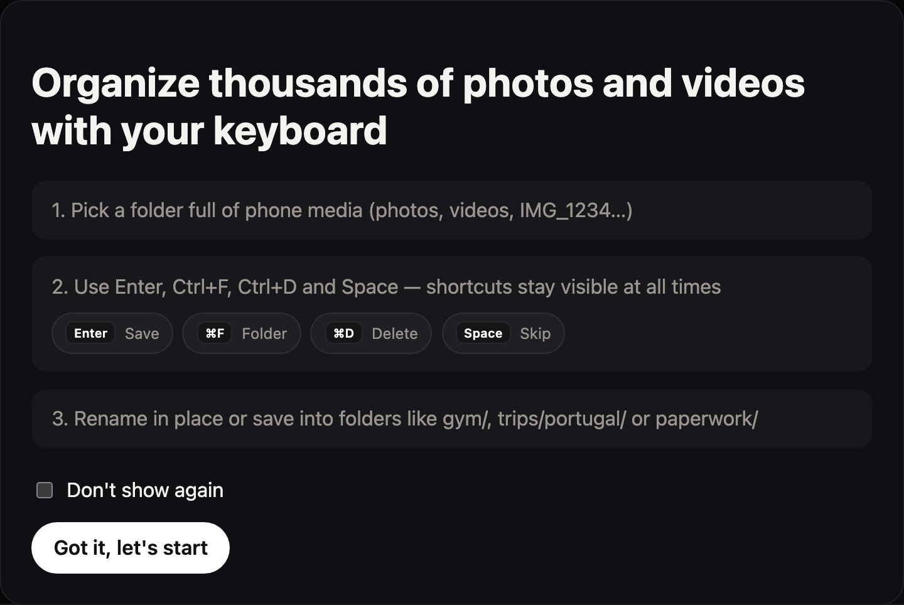
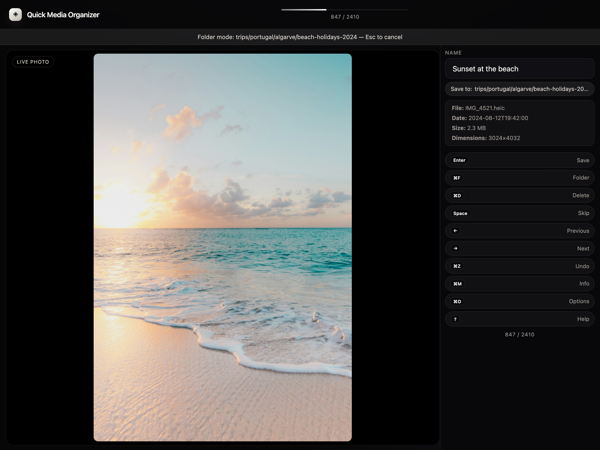
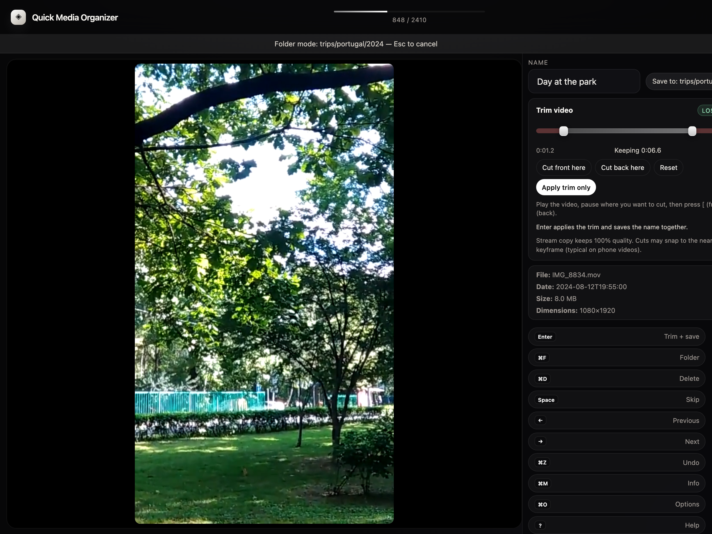

# Quick Media Organizer

**Organiza miles de fotos y vídeos del móvil con el teclado — sin usar el ratón.**


[🇬🇧 Read in English](README.md)

<p align="center">
  
</p>

---

## Por qué lo hice

Sinceramente: **lo necesitaba yo**.

Tenía carpetas llenas de backups del móvil — miles de archivos `IMG_1234…` mezclados con vídeos — y ninguna herramienta me convencía: lentas, pesadas o pensadas para otra cosa. No quería una biblioteca de fotos completa. Solo quería **renombrar**, **ordenar en carpetas**, **recortar vídeos** y **seguir** — lo más rápido posible, con las manos en el teclado.

Así que creé **Quick Media Organizer**. No es un pitch de startup; es una herramienta que uso a diario. La comparto en open source porque espero que le sirva a alguien más con el mismo lío.

Si te ahorra tiempo, te agradecería de corazón un [café ☕](https://buymeacoffee.com/ferran_vidal). Me ayuda a seguir mejorándola cuando tengo ratos libres.

---

## Qué hace

- **Renombrar** fotos y vídeos al instante con `Enter`
- **Mover** a subcarpetas como `gym/`, `viajes/portugal/`, `documentos/` con `Ctrl+F`
- **Recortar vídeos sin pérdida** (FFmpeg, copia de streams) antes de guardar
- **Eliminar con seguridad** a `_deleted/` dentro de tu carpeta — nunca permanente, siempre deshacer
- **Saltar**, **navegar** y **deshacer** sin ratón
- **Live Photos** (`.heic` + `.mov`) se mueven, renombran y eliminan juntos
- Se conservan las fechas **EXIF** y los timestamps originales

<p align="center">
  
</p>

<p align="center">
  
</p>

---

## Descarga

Última versión para tu plataforma:

**[GitHub Releases →](https://github.com/FerranVidalBelles/quick-media-organizer/releases)**

macOS (`.dmg`) · Windows (`.msi` / `.exe`)

### Primer arranque (builds sin firmar)

| SO | Aviso posible | Qué hacer |
|----|---------------|-----------|
| **macOS** | Desarrollador no identificado | Clic derecho → **Abrir** → confirmar una vez |
| **Windows** | SmartScreen | **Más información** → **Ejecutar de todas formas** |

---

## Atajos de teclado

| Tecla | Acción |
|-------|--------|
| `Enter` | Renombrar o guardar en carpeta *(también aplica recorte pendiente)* |
| `Ctrl+F` / `⌘F` | Elegir o crear subcarpeta |
| `Ctrl+D` / `⌘D` | Mover a `_deleted/` *(funciona mientras escribes)* |
| `Delete` | Mover a `_deleted/` *(fuera del campo de texto)* |
| `⌘⇧Space` / `Ctrl+Space` | Saltar |
| `←` `→` | Anterior / siguiente |
| `Ctrl+Z` / `⌘Z` | Deshacer |
| `Ctrl+M` / `⌘M` | Ver metadata |
| `Ctrl+O` / `⌘O` | Opciones |
| `?` | Ayuda |
| `[` `]` | Marcar inicio / fin de recorte de vídeo |
| `Esc` | Cancelar carpeta armada / cerrar modal |

Los atajos están **siempre visibles** en la barra inferior.

---

## FAQ

**¿Delete borra para siempre?**  
No. Los archivos van a `_deleted/` dentro de tu carpeta.

**¿Pierdo la fecha de captura?**  
No. Se conserva EXIF y timestamps.

**¿Vídeos y Live Photos?**  
Sí. Los vídeos se previsualizan y recortan sin re-codificar. Los pares Live Photo van juntos.

**¿HEIC en Windows?**  
Organizar funciona. La preview puede mostrar solo metadata en algunos casos.

**¿FFmpeg para recortar?**  
Necesario solo para recortar. `brew install ffmpeg` en macOS. Renombrar y organizar funcionan sin él.

---

## Compilar

Requisitos: Node.js 20+, Rust

```bash
git clone https://github.com/FerranVidalBelles/quick-media-organizer.git
cd quick-media-organizer
npm install
npm run tauri dev
```

Instaladores:

```bash
npm run tauri build
```

---

## Apoyo y contacto

Proyecto personal hecho por necesidad. Si te resulta útil:

- ☕ **[Invítame a un café](https://buymeacoffee.com/ferran_vidal)**
- ✉️ **Email:** [ferranvidaldev@gmail.com](mailto:ferranvidaldev@gmail.com)
- 💼 **LinkedIn:** [ferran-vidal-belles](https://www.linkedin.com/in/ferran-vidal-belles/)

Issues y PRs bienvenidos. No prometo soporte instantáneo, pero leo todo.

---

## Licencia

MIT — ver [LICENSE](LICENSE).

**Autor:** [Ferran Vidal Bellés](https://github.com/FerranVidalBelles)
